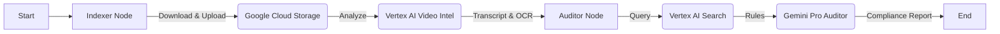

# Brand Guardian AI

**Automated Video Compliance Auditing using Google Cloud Vertex AI.**

Brand Guardian AI is an intelligent agent designed to audit video content (e.g., commercials, social media ads) against strict brand safety guidelines and regulatory rules. It leverages a multi-modal AI pipeline to transcription, read on-screen text (OCR), and strictly evaluate content using a Retrieval-Augmented Generation (RAG) architecture.

---

## 🚀 Key Features

*   **Multi-Modal Analysis**: Uses **Vertex AI Video Intelligence** to extract:
    *   🗣️ **Speech Transcription**: Full dialogue extraction with speaker diarization.
    *   🔡 **OCR (Optical Character Recognition)**: Reads on-screen text using a fallback and sanitation mechanism for high accuracy.
    *   ⏱️ **Metadata**: Duration, platform info.
*   **Compliance RAG Engine**:
    *   Retrieves specific compliance rules from a **Vertex AI Search** data store (containing PDFs of brand guidelines).
    *   Uses **Gemini 2.5 Flash** to perform a strict audit based *only* on the retrieved rules.
*   **Workflow Orchestration**: Built with **LangGraph** for a robust, state-based execution flow.
*   **Dual Interface**:
    *   **CLI**: Run local simulations instantly.
    *   **API**: Production-ready FastAPI endpoints for integration.

---

## 🏗️ Architecture

The system follows a sequential LangGraph workflow:



---

## 🛠️ Prerequisites

*   **Python 3.10+** (Managed via `uv` or `pip`)
*   **Google Cloud Platform (GCP) Account** with matching APIs enabled:
    *   Vertex AI API
    *   Video Intelligence API
    *   Discovery Engine API (Vertex AI Search)
    *   Cloud Storage API
*   **FFmpeg**: Required for `yt-dlp` video processing.

---

## ⚙️ Installation & Setup

1.  **Clone the Repository**
    ```bash
    git clone <repository-url>
    cd brand-guardian-ai
    ```

2.  **Install Dependencies**
    Using `uv` (Recommended):
    ```bash
    uv sync
    ```
    Or using `pip`:
    ```bash
    pip install -r requirements.txt
    ```

3.  **Configure Environment Variables**
    Create a `.env` file in the root directory:
    ```ini
    # Google Cloud Config
    GOOGLE_CLOUD_PROJECT=your-project-id
    GOOGLE_CLOUD_LOCATION=asia-southeast1
    GCS_BUCKET_NAME=your-bucket-name

    # Vertex AI Config
    VERTEX_AI_LOCATION=asia-southeast1
    VERTEX_AI_MODEL_NAME=gemini-2.0-flash
    
    # Vertex AI Search (RAG)
    VERTEX_SEARCH_LOCATION=global
    VERTEX_SEARCH_DATA_STORE_ID=your-datastore-id
    ```

4.  **Google Cloud Authentication**
    Ensure you are authenticated locally:
    ```bash
    gcloud auth application-default login
    ```

---

## 📖 Usage

### 1. Ingest Brand Guidelines (RAG Setup)
Upload your compliance PDF manuals to the Vertex AI Search Data Store.
```bash
python backend/scripts/index_documents.py
```
*   Places PDFs from `backend/data/` into your GCS Bucket connected to Vertex AI Search.

### 2. Run CLI Simulation
Test the entire pipeline with a YouTube URL directly in your terminal.
```bash
python main.py
```
*   Edit `main.py` to change the `video_url` variable.

### 3. Run API Server
Start the FastAPI server for production usage.
```bash
uv run uvicorn backend.src.api.server:app --reload
```
*   **Endpoint:** `POST /audit`
*   **Payload:** `{"video_url": "https://youtu.be/..."}`
*   **Docs:** Visit `http://127.0.0.1:8000/docs`

---

## 📂 Project Structure

```text
├── backend/
│   ├── data/                 # Folder for PDF Guidelines (Knowledge Base)
│   ├── scripts/              # Utility scripts (e.g., Ingestion)
│   └── src/
│       ├── api/              # FastAPI Server & Telemetry
│       ├── graph/            # LangGraph Workflow (Nodes, State, Graph)
│       └── services/         # Video Intelligence Logic (Download, Upload, Analyze)
├── main.py                   # CLI Entry Point
├── pyproject.toml            # Dependencies
└── README.md                 # Documentation
```

---

## 📝 Logging & Observability

The system features structured logging (`--- [Stage] Message ---`) for easy debugging.
*   **[Indexer]**: Tracks video download, upload, and analysis status.
*   **[Auditor]**: Tracks RAG retrieval queries and LLM generation.
*   **Telemetry**: (Optional) Can push traces to Google Cloud Trace if configured.

---

## 📄 License

[MIT License](LICENSE)
